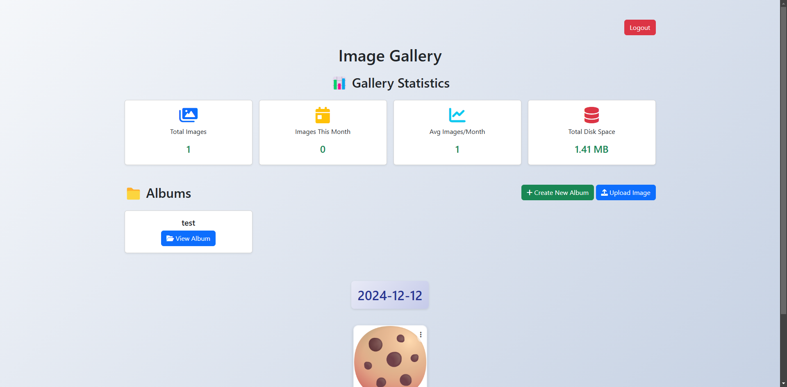

# ShareX Custom Host Upload Script + Online Image Gallery



## Overview
This project provides a custom host upload script that seamlessly integrates with [ShareX](https://getsharex.com/) and an online image gallery for easy management of uploaded images.

## Features
- **Login Menu**: Secure authentication for managing uploaded images.
- **Direct Site Upload**: Upload images directly via the website.
- **Image Management**: Delete, move, and organize uploaded images.
- **Album Organization**: Group images into albums for better organization.
- **Custom ShareX Host Support**: Integrate with ShareX for automatic uploads.

## How It Works
- Uploaded images are accessible via a base domain structure, allowing direct access.
- Example:
  - `i.domain.com/photo.png` or `img.domain.com/photo.png` fetches the image directly.
  - The image gallery is accessible at `i.domain.com/gallery`.

## Installation
1. Clone the repository:
   ```sh
   git clone https://github.com/booskit-codes/sharex-php-gallery.git
   ```
2. Configure your web server (e.g., Nginx or Apache) to handle subdomains correctly.
3. Set up a database for image management and authentication.
4. Update configuration files with your domain details.
5. Deploy the script to your server.

## ShareX Configuration
To integrate with ShareX:
1. Open ShareX and navigate to **Destinations > Custom uploader settings**.
2. Add a new uploader with the following:
   - **Request URL**: `https://i.domain.com/upload.php`
   - **Method**: `POST`
   - **Parameters**: API key or authentication token (if required)
3. Set the response URL format to match your domain structure.

## Contribution
Feel free to submit pull requests or report issues to improve the project.

## Contact
For support or questions, reach out to [direct@booskit.dev](mailto:direct@booskit.dev).
